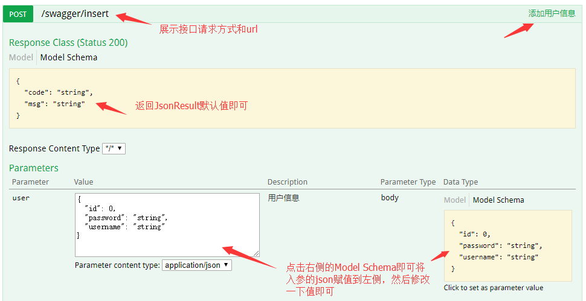

### 注解

分清注解和注释，注解是给计算机看的，而注释是给程序员看的。注解也叫元数据

注解的本质是一个接口，只不过使用方式有一点特别而已，默认继承Annotation接口

注解（接口）中的抽象方法**必须有规定好的返回值类型**（不能为void，不能是自定义的类或者接口（但可以是注解接口））

注解可以套注解（有些注解是核心类已经规定好的直接用），就像接口能继承其它接口一样

注解就好像一个可以附着在其它类上面的接口，当定义好他的生效范围和接口中需要设置的值，可以直接通过class对象读取生成一个这个注解的接口对象，从而获取到注解里面的相关信息给程序。一个注解就代表一个注解的接口对象

当使用注解时只用到了注解的value（每个注解必须有）抽象方法的时候，value前缀可以省略（使用的时候，其他的抽象方法都有默认的返回值）

接口中的被default修饰：

​	普通的接口的default关键字在前面，是默认将方法实现，这样就相当于抽象类，但是它可以实现多继承。

​	注解这个特殊的接口，default关键字在后面，表示默认的返回值，大括号表示返回值是一个数组或者集合，普	通接口的大括号肯定就是代表方法体

```java
例子：@Target({ElementType.TYPE, ElementType.METHOD, ElementType.FIELD})
TYPE：接口、类、枚举、注解
FIELD:字段枚举的常量
METHOD：方法
PARAMETER：方法参数
CONSTRUCTOR：构造函数
LOCAL_VARIABLE：局部变量
ANNOTATION_TYPE：注解
PACKAGE：包
TYPE_PARAMETER：参数类型声明
TYPE_USE：使用的类型
```

```java
@Retention(RetentionPolicy.RUNTIME)
```

| RetentionPolicy.SOURCE  | 表示注解只保留在源文件，当java文件编译成class文件，就会消失  | 源文件            | 只是做一些检查性的操作，，比如 @Override 和 @SuppressWarnings |
| ----------------------- | ------------------------------------------------------------ | ----------------- | ------------------------------------------------------------ |
| RetentionPolicy.CLASS   | 注解被保留到class文件，但jvm加载class文件时候被遗弃，这是默认的生命周期 | class文件（默认） | 要在编译时进行一些预处理操作，比如生成一些辅助代码（如 ButterKnife） |
| RetentionPolicy.RUNTIME | 注解不仅被保存到class文件中，jvm加载class文件之后，仍然存在  | 运行时也存在      | 需要在运行时去动态获取注解信息                               |

### Spring两大特性：IOC && DI

#### IOC（Inversion Of Control反转控制）

耦合性高的都是直接new对象，现在是问工厂要，工厂会创造返回我们想要的对象。

工厂创造出来的对象放在map中，这个map就被称为容器

同时，程序将new对象的权利交由工厂，这就是控制反转，其实是控制权转移

我觉得Spring容器的存在让这些层间依赖的对象全部交由Spring来进行管理，这就很nice，防止程序的乱引用的对象的大量创建，反正好处多多

#### DI（Dependency Injection依赖注入）

依赖注入说白了就是来管理对象之间的依赖，因为两个对象之间难免有依赖，既然对象创建权利交给你了，那么依赖关系你也要给我维护

但是依赖注入的本质就是给参数赋值，如果一个对象的成员是另一个对象（依赖关系），那么就是给这个成员的赋值方法变成使用在配置文件中配置过的 bean进行赋值!

### Spring 常用注解

* @Controller @Service @Repository和@Component作用是一样的，只不过是为了区别一下三层架构。直接放在类名上面，vlaue就是id值。如果不写，默认就是类名的首字母小写值

  * @Controller：一般用于表现层的注解。

    @Service：一般用于业务层的注解。

    @Repository：一般用于持久层的注解。

* @Autowired：

  * 首先明白，Spring的Ioc容器里面的对象，只要是单例（多例也行）的，只要被注解了，那么加载xml文件或者扫描带有注解的包的时候，对象就会都被放在容器里面，而且是以Map集合的方式，id就是他的key
  * 标签是放在类的成员变量上的，自动注入，**不需要set方法**，首先，它会去IOC容器里面找类型和添加注解的属性（对象的属性，成员变量等）一样的bean（所有向上转型能转成本类的都算，搞一个object类都能配上59个bean，离谱），如果找到一个，那么就注入成功。**如果找到多个，就查看有没有id（Map的key）和成员变量名一样的**，如果有，则注入成功，否则报异常
  * 名字、类型都很重要。最好名字和注解写的key一样，那就肯定能成功
  * 不管是单例、多例的作用范围，自动注入都会按照规则拿到对象进行注入的
  * 有三种注入方式，构造函数、setter和属性注入。不推荐属性注入了已经。使用构造函数注入的时候，如果只有一个构造函数，可以省略autowired。由多个构造函数，容器会默认使用无参构造方法，加上autowired，容器就会去使用这个有参的构造了，也就可以注入了。setter建议加上autowired。优点就是解决执行顺序问题等

* @Qualifier：

  * 就是为了弥补@Autowired标签的报错，当不能自动注入了就寻找这个标签的id。
  * 必须和@Autowired配合才能使用

* @Resource：

  * 不使用自动注入，直接按照id注入

* @Value：

  * 上面三个标签都是注入引用数据类型的，这个标签才是用来注入基本数据类型和String类型数据
  * 这个标签，可以直接给对象的赋值，但Value就是要存在，体会一下

* @Scope：

  * 改变作用范围，就是对象是单例的，还是多例的
  * @Scope("prototype")//多实例，**IOC容器启动创建的时候，并不会创建对象放在容器在容器当中，当你需要的时候，需要从容器当中取该对象的时候，就会创建**。
    @Scope("singleton")//单实例 ，**IOC容器启动的时候就会调用方法创建对象，以后每次获取都是从容器当中拿同一个对象**（map当中）。
    @Scope("request")//同一个请求创建一个实例
    @Scope("session")//同一个session创建一个实例

* @PostConstruct：指定初始化方法

* @PreDestroy：指定销毁方法

* @Bean：**写在方法上**，表明用这个方法创建一个对象，并且放在容器里面

* @Import：用于导入其他配置类，比如jar包里面的对象导入进来放入容器里面

* 通过注解获取容器：

  ```xml
  ApplicationContext ac = 
  new AnnotationConfigApplicationContext(SpringConfiguration.class);
  ```

* @ServletComponentScan
  * SpringBootApplication 上使用@ServletComponentScan 注解后
    Servlet可以直接通过@WebServlet注解自动注册
    Filter可以直接通过@WebFilter注解自动注册
    Listener可以直接通过@WebListener 注解自动注册
  * 不使用这个注解，其他的requestMapping也能正常使用，就是单纯的上面几种不能使用

* @Mapper
  * 在接口类上添加了@Mapper，在编译之后会生成相应的接口实现类，并将实现类生成对象交给spring容器
  * 添加位置：接口类上面
* @MapperScan
  * 指定要变成实现类的接口所在的包，包下面的所有接口在编译之后都会生成相应的实现类，并将实现类生成对象交给spring容器
  * 添加位置：是在Springboot启动类上面添加，

* @ComponentScan

  * 扫描指定包下注释过的容器对象放入
  * 没指定的就不放

* @Configuration

  * 用于定义配置类，可替换XML配置文件，被注解的类内部包含一个或多个`@Bean`注解方法。可以被`AnnotationConfigApplicationContext`或者`AnnotationConfigWebApplicationContext` 进行扫描。这两个类应该是启动时专门用来扫描配置的
  * Configuration的那个类也会被放入容器被特殊的配置类扫描到


### slf4j

SLF4J，即简单日志门面（Simple Logging Facade for Java），不是具体的日志解决方案，它只服务于各种各样的日志系统。按照官方的说法，SLF4J是一个用于日志系统的简单Facade，允许最终用户在部署其应用时使用其所希望的日志系统。**你只需要按统一的方式写记录日志的代码，而无需关心日志是通过哪个日志系统，以什么风格输出的。因为它们取决于部署项目时绑定的日志系统。**

SpringBoot中集成了slf4j

这里指定的是日志配置文件是**根路径下**的 `logback.xml` 文件

通过配置文件可以把日志信息存储到文件中而不是控制台上，同时也能按天按文件单个大小去记录日志，更方便定位日志。

还可以配置日志的输出级别，RACE > DEBUG > INFO > WARN > ERROR，越大越全面

#### 获取配置文件的键值对

1、@Value("${url.orderUrl}")直接注入，注解加载成员变量上

2、@ConfigurationProperties(prefix = "url") + @Component，注解加在类上面，使用这个注解需要先倒入依赖

```xml
<dependency>
	<groupId>org.springframework.boot</groupId>
	<artifactId>spring-boot-configuration-processor</artifactId>
	<optional>true</optional>
</dependency>

```

使用的时候注入该对象就行

### SpringMVC的常用注解

**@ResponseBody**

将返回信息转换为json字符串

**@RestController**

 `@RestController` 注解包含了原来的 `@Controller` 和 `@ResponseBody` 注解，两者的组合而已

**@RequestMapping**

用来处理请求地址映射的注解，它可以用于类上，也可以用于方法上。在类的级别上的注解会将一个特定请求或者请求模式映射到一个控制器之上，表示类中的所有响应请求的方法都是以该地址作为父路径；在方法的级别表示进一步指定到处理方法的映射关系。

注解有6个属性，一般在项目中比较常用的有三个属性：value、method 和 produces

**@PathVariable**

这个是用来解析url里面的字段的，可以同时解析多个字段，记得设置好占位符

**@RequestParam**

@PathValiable 是从 url 模板中获取参数值， 即这种风格的 url：http://localhost:8080/user/{id} 

而 @RequestParam 是从 request 里面获取参数值，即这种风格的 url：http://localhost:8080/user?id=1 除了 value 属性外，还有个两个属性比较常用：

- required 属性：true 表示该参数必须要传，否则就会报 404 错误，false 表示可有可无。
- defaultValue 属性：默认值，表示如果请求中没有同名参数（就是方法括号里面的参数名字）时，就用这个作为参数的默认值。

不设置method的时候request和post方法都行

**@PostMapping**

@PostMapping就等于@RequestMapping(method = RequestMethod.POST).

**@RequestBody**

`@RequestBody` 注解用于接收前端传来的实体，接收参数也是对应的实体，比如前端通过 json 提交传来两个参数 username 和 password，此时我们需要在后端封装一个实体来接收。就是把参数封装到类里面。

只接受json格式的数据

# Swagger

Swageer与fastjson冲突，找不到解决办法，不使用fastjson

@ApiModel("user类)

@ApiModelProperty(value = "USER的id")

这两个标签方便用来描述javabean类


@Api(tags = "我是test",description = "test的描述")


@ApiOperation(value = "根据用户唯一标识获取用户信息")

Api用来描述一个大类，这个用来描述一个具体的url


@ApiParam("性别") String gender

用来描述参数




在@RequestMapping(value = "/hello2/{id}/{name}",method = RequestMethod.GET)指定来method后，swagger文档中就不会列举出所有的方法，只会列举出指定的get方法

# Thymeleaf

关闭缓存，否则页面无法及时更新

之前在 Controller 层上都是使用的 @RestController 注解，自动会把返回的数据转成 json 格式。但是在使用模板引擎时，Controller 层就不能用 @RestController 注解了，因为在使用 thymeleaf 模板时，**返回的是视图文件名**，比如上面的 Controller 中是返回到 **index.html** 页面，**如果使用 @RestController 的话，会把 index 当作 String 解析了，直接返回到页面了**，而不是去找 index.html 页面，大家可以试一下。所以在使用模板时要用 @Controller 注解。

使用 `th:value="*{属性名}"`
使用 `th:value="${对象.属性名}"`，对象指的是上面使用 `th:object` 获取的对象
使用 `th:value="${对象.get方法}"`，对象指的是上面使用 `th:object` 获取的对象

也能遍历数组、集合对象放入html的页面

# Spring Boot全局异常处理

各个代码流程中可能会发生一场，如果对每个过程都单独作异常处理，**那系统的代码耦合度会变得很高**，此外，开发工作量也会加大而且不好统一，这也增加了代码的维护成本。
针对这种实际情况，我们需要**将所有类型的异常处理从各处理过程解耦出来**，这样既保证了相关处理过程的功能单一，也实现了异常信息的统一处理和维护。同时，我们也不希望直接把异常抛给用户，应该对异常进行处理，**对错误信息进行封装，然后返回一个友好的信息给用户**。
使用 `@ControllerAdvice` 注解，`@ResponseBody` 注解是为了异常处理完之后给调用方输出一个 json 格式的封装数据。通过 `@ExceptionHandler` 注解来指定具体的异常，然后在方法中处理该异常信息，最后将结果通过统一的 json 结构体返回给调用者。

发生了16:04:41.128 [http-nio-8080-exec-1] WARN  o.s.w.s.m.s.DefaultHandlerExceptionResolver - Resolved [org.springframework.http.converter.HttpMessageNotWritableException: No converter for [class top.kairecession.demo01.error.JsonResult] with preset Content-Type 'null']

检查是否生成了java bean的set和get方法

```
@ExceptionHandler(MissingServletRequestParameterException.class) 括号中接受要处理的异常类型
@ResponseStatus(value = HttpStatus.BAD_REQUEST) 返回的异常类型，不加这个也行，会在浏览器看到这个status的状态码
public 返回 函数名(MissingServletRequestParameterException ex) 括号写接受的异常类
```

甚至可以直接处理一个大Excption，和throw一样


# AOP（spect Oriented Programming） 面向切面编程

达到一种可配置的、可插拔的程序结构

1、引入AOP的依赖

<dependency>
	<groupId>org.springframework.boot</groupId>
	<artifactId>spring-boot-starter-aop</artifactId>
</dependency>

0.@Aspect 定义一个切面类，是在类上面，同时这个类要交给spring容器中

切面：剖解开封装的对象内部，并将那些**影响了多个类的公共行为封装到一个可重用模块**，并将其名为“Aspect”，即方面。所谓“方面”，简单地说，就是将那些与业务无关，却为业务模块所共同调用的逻辑或责任封装起来，便于**减少系统的重复代码，降低模块间的耦合度**，并有利于未来的可操作性和可维护性。

1.@Pointcut：定义一个切面，即上面所描述的关注的某件事入口。这个注解加在空方法上，主要是为了把execution表达式抽取出来，让@Before等不用重复写同一个execution。本来@Before里面要写execution的，这时只用写Pointcut注解后的那个方法名就行了，两个都被vaule属性接受。也叫切入点，在execution描述的方法中切入。**Pointcut要和Before在同一个类中**

2.@Before：在做某件事之前做的事。也叫连接点（joinpoint），这个时候连接点在事情执行的前面

3.@After：在做某件事之后做的事。连接点在后面，以此类推

4.@AfterReturning：在做某件事之后，对其返回值做增强处理。

```
// returning中的名字要和方法中的一致
// resut是未经转化的原方法return结果
// 直接修改result就可以
```

5.@AfterThrowing：在做某件事抛出异常时，处理。

# Mybatis

倒入依赖

<dependency>
	<groupId>org.mybatis.spring.boot</groupId>
	<artifactId>mybatis-spring-boot-starter</artifactId>
	<version>1.3.2</version>
</dependency>
<dependency>
	<groupId>mysql</groupId>
	<artifactId>mysql-connector-java</artifactId>
	<scope>runtime</scope>
</dependency>

使用@Mapper注解直接一个接口就可以实现查询。原理：Mybatis会根据sqlSession创建一个Mapper的代理类，生成一个真实的对象

**使用MapperScan后，Mapper失效**

封装成类的时候，有可能double类型的属性接受到了数据库的记录为null，这时候就转换就有异常。建议修改查询语句

```
@Results({@Result(property = "classes", column = "class")})
```

加在方法上，将数据库查询结果的字段对应到对象中，输入是查询结果

@Param("id") Long id

加在方法的行参前，将对象中的属性拿出来对应到查询参数上去，输入是对象